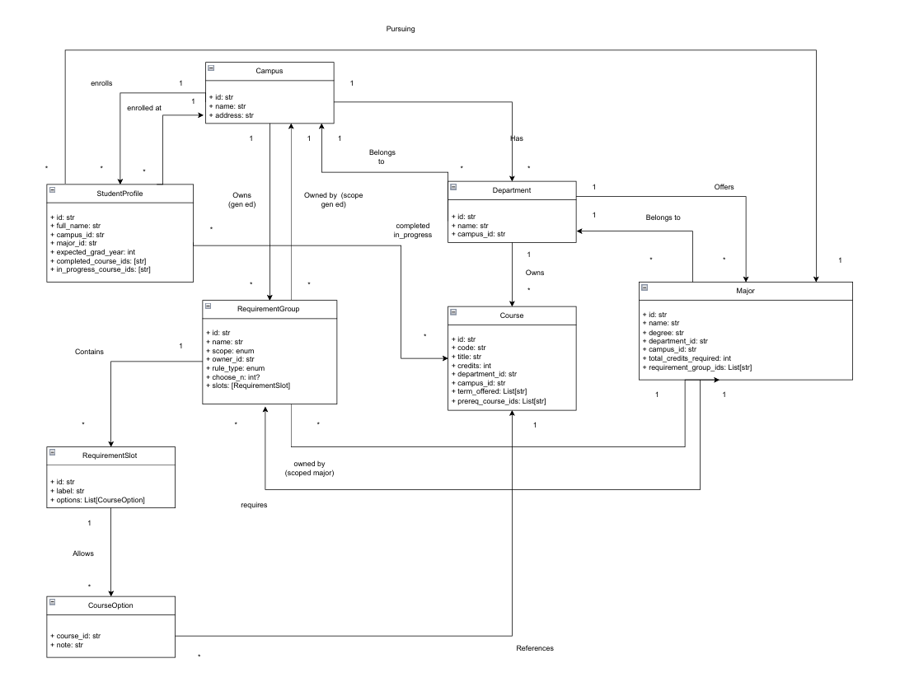

# 🚀 UniBrain – The Intelligence Layer for Universities

UniBrain is an early-stage prototype exploring how universities can unify fragmented academic data into a single structured intelligence layer.

At its core, UniBrain models university knowledge—programs, majors, courses, requirements, rules, and directories—using a formal ontology.
On top of this structure, UniBrain exposes UniAssist, an AI-powered interface that can answer academic questions with clarity, traceability, and context.

>LONG-TERM VISION:
UniBrain aims to become the _Palantir of higher education_ — a centralized, explainable intelligence layer that brings consistency, automation, and reasoning to university operations.

This repository contains v1, a closed-beta demo designed for early discussions with LIU Brooklyn IT and Engineering leadership.

---

## 🌐 Problem Context

Universities operate with deeply fragmented information:
- Degree requirements buried in PDFs
- Course catalogs scattered across departments
- Advising logic living in people’s heads
- Substitutions and exceptions applied inconsistently
- Students receiving conflicting answers

As a result:
- Advising is slow and manual
- Students are confused and mistrust outcomes
- Policy knowledge does not scale

---

## 🧠 UniBrain Concept

UniBrain separates **knowledge modeling** from **user interaction**.

### 🧩 UniBrain Ontology (Knowledge Graph)

A structured domain model representing:

- Campuses  
- Departments  
- Majors  
- Courses  
- Degree requirements  
- Relationships and constraints between them  

The ontology is designed to be:

- Explicit  
- Queryable  
- Explainable  
- Extensible across institutions  

### 💬 UniBrain Assist (AI Interface)

An AI-powered assistant layered on top of the ontology that can answer questions such as:

- What courses do I still need to graduate as a CS major?  
- What are the prerequisites for BIO 102?  
- How do I contact the registrar?  
- Which requirements would change if I switch majors?  

Unlike traditional chatbots, UniBrain’s answers are grounded in **structured academic rules**, not opaque text generation.

---

## 💡 UniBrain’s Approach

UniBrain treats the university as a reasoning system, not a set of webpages.

ONTOLOGY-DRIVEN CORE:
UniBrain explicitly models:
- Students and profiles
- Courses (completed vs in-progress)
- Programs / degrees
- Requirements and categories
- Rules (prereqs, substitutions, exceptions, limits)
- Directories and resources

All relationships are first-class entities, not inferred text.

UNIASSIST (INTERFACE LAYER):
UniAssist sits on top of the ontology and:
- Answers academic questions
- Explains why something counts (or doesn’t)
- Traverses relationships instead of searching text
- Produces consistent, explainable outputs

---

## 🧩 Current v1 Scope

AUTHENTICATION:
- Email + password login
- Signup gated by invite codes
- Secure password hashing
- Logout support
- Optional persistent login (“Remember me”)

ONBOARDING FLOW:
- Mandatory student onboarding after signup
- StudentProfile captures:
  - Full name
  - Campus (v1: LIU Brooklyn)
  - Major (v1: Computer Science BS)
  - Expected graduation year
  - Completed courses (term-structured)
  - In-progress courses (term-structured)

ABUSE PREVENTION (BETA-GRADE):
- Invite codes with configurable max_uses
- Atomic invite consumption
- IP-based signup rate limiting
- Designed to prevent invite exhaustion and scripted signups

SESSION & SECURITY DESIGN:
- Session-only login by default
- Optional long-lived sessions via remember-me
- Reverse-proxy aware (Caddy planned)
- Designed for clean production deployment

---

## 🔐 Access Control (v1)

This prototype is **invite-only**.

Signup requires a valid invite code, which:

- Has limited uses  
- Can expire  
- Can be revoked if abused  

Invite codes are stored server-side and consumed transactionally during signup.  
This keeps early access controlled while the platform is not production-ready.

This mechanism is intentionally lightweight and designed to be replaced or expanded
(e.g., per-user invites, allowlists, or SSO) in later phases.

---

## 🤝 Status

UniBrain is an **exploratory prototype**.

It is not production software and does not integrate with live student systems.  
Any real deployment would require coordination with:

- University IT  
- Registrar  
- Academic Affairs  
- Compliance and FERPA stakeholders  

---

## 🚧 Roadmap

### Near-Term

- Student profile onboarding  
- Degree progress evaluation  
- Ontology-backed query endpoints  
- Assistant proof-of-concept  
- Visual requirement graph  

### Long-Term

- SIS integration  
- LMS integration  
- Multi-campus support  
- Admin dashboards  
- AI-assisted advising engine  
- Automated ontology ingestion pipelines  

---


## ▶️ Running the Project Locally

### 1️⃣ Clone the repository

```bash
git clone https://github.com/AbdallahZein12/UniBrain.git
cd UniBrain
```

### 2️⃣ Create and activate a virtual environment

```bash
python -m venv env
```

```bash
# macOS / Linux
source env/bin/activate

# Windows
env\Scripts\activate
```

### 3️⃣ Install dependencies

```bash
pip install -r requirements.txt
```

### 4️⃣ Run database migrations

```bash
python -m flask --app wsgi db upgrade
```

### 5️⃣ Set up .env variables (example)

```bash
FLASK_ENV=dev
SECRET_KEY=yoursecret
```

### 6️⃣ Start the development server

```bash
python -m flask --app wsgi run
```

### 7️⃣ Open the app

```bash
http://localhost:5000
```

---

## 📓 Development Log

**12/12/2025** – Added ontology / models diagram  



**12/15/2025** – Added landing page desgin, logo and login portal (dev_login_feature)

**12/21/2025** – Added landing page, authentication flow, and invite-only access

**12/22/2025**
- Completed full authentication flow
- Implemented login and signup routes
- Added invite-code-gated access
- Added login/signup modal to home page
- Implemented remember-me functionality
- Implemented logout flow
- Laid groundwork for onboarding enforcement

**12/23/2025**:
- Built full onboarding experience
- Finalized StudentProfile schema
- Added term-structured course input
- Enforced onboarding via route guards
- Implemented IP-based signup rate limiting
- Designed invite abuse prevention strategy
- Hardened session behavior
- Prepared deployment considerations for Caddy

---

STATUS:
This is a closed-beta MVP built for iteration, demos, and architecture validation.
No production student data. No billing. No open signups.

© 2025 UniBrain. All rights reserved.